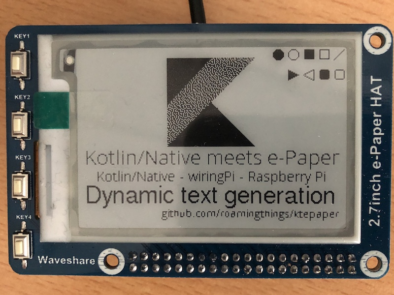

# Kotlin-Native e-Paper application

_This project is at a very early stage and many parts are still incomplete._

This project aims to enable kotlin-native apps running on a Raspberry Pi to utilize
an e-Paper display like the
[2.7inch e-Paper HAT from Waveshare](https://www.waveshare.com/wiki/2.7inch_e-Paper_HAT).

To communicate with the display a wrapper for the the famous [wiringPi](http://wiringpi.com)
library is included. At the moment a statically compiled library is used. Until I have
figured out how to redistribute or include the wiringPi source into this project you have to
get the project, build a static library on a Raspberry Pi and copy it into the following
folders of this project:

* Header files to `external/wiringpi/raspberrypi/includeh` and `kwiringpi/src/main/c_interop/external/wiringpi/raspberrypi/include`
* Library file to `external/wiringpi/raspberrypi/lib` 

The wiringPi wrapper library may be migrated to a separate project eventually.

## Building the project

To build the project in a non-Linux environment (e.g. macOS) you can use a docker image for
the build. See the `docker` folder for sample images that allow cross compiling of
Kotlin/Native.

## Deploying to a target

If you have a Raspberry Pi zero (W) setup to be connected by USB OTG you can use the `deploy.sh`
and `halt_target.sh` scripts to control the target. Create a file `.target` containing the
username and host of your target (e.g. `pi@raspberry.local`).

